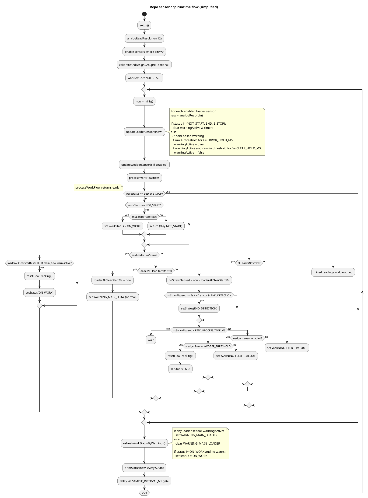

# planting_flow.md (summary of current repo logic)

> Source: current repo implementation in `bake/sensor.cpp`, `bake/sensor.h`, `bake/warning.h`.
>
This document summarizes what the code **actually does now** (not the external flowchart).

## 1) Key design choices in current repo
- Loader zone uses **4 analog IR sensors** (AO -> `analogRead()`), stored as `loaderSensors[]`.
- The code interprets **"has straw"** as `raw < threshold` (AO low when blocked/detected).
- Each loader sensor has an independent **hold-based warning**:
  - `raw > threshold` for `ERROR_HOLD_MS` => `warningActive=true`
  - after warning, `raw <= threshold` for `CLEAR_HOLD_MS` => clear warning
- A system-level `WorkStatus` state machine exists:
  - `STATUS_NOT_START`, `STATUS_ON_WORK`, `STATUS_END_DETECTION`, `STATUS_END`, `STATUS_E_STOP`
- A warning registry `WarnStatusGroup` stores active warnings (main and sub types) and throttles repeated logs.

---

## 2) PlantUML flowchart (repo behavior)



---

## 3) Equivalent if-else pseudo code (repo behavior)

```cpp
setup() {
  Serial.begin(115200);
  analogReadResolution(12);

  for each loader sensor i:
    enabled = (pin >= 0);

  if (wedger enabled):
    enabled = (pin >= 0);

  calibrateAndAssignGroups(); // uses averaging over CALIBRATION_MS
}

loop tick every SAMPLE_INTERVAL_MS {
  now = millis();

  // A) sample & per-sensor warning
  for each enabled loader sensor:
    raw = analogRead(pin);

    if (status in {NOT_START, END, E_STOP}) {
      warningActive=false; timers=0;
    } else {
      if (raw > threshold for >= ERROR_HOLD_MS) warningActive=true;
      if (warningActive && raw <= threshold for >= CLEAR_HOLD_MS) warningActive=false;
    }

  if (wedger enabled) wedgerRaw = analogRead(wedgerPin);

  // B) workflow state machine
  if (status == END || status == E_STOP) {
    // do nothing
  } else {
    if (status == NOT_START) {
      if (anyLoaderHasStraw()) status = ON_WORK;
      else goto print;
    }

    if (anyLoaderHasStraw()) {
      if (loaderAllClearStartMs != 0 || has WARNING_MAIN_FLOW) {
        resetFlowTracking();
        status = ON_WORK;
      }
    } else if (allLoaderNoStraw()) {
      if (loaderAllClearStartMs == 0) {
        loaderAllClearStartMs = now;
        set WARNING_MAIN_FLOW;
      } else {
        elapsed = now - loaderAllClearStartMs;

        if (elapsed >= 5s) status = END_DETECTION;

        if (elapsed >= FEED_PROCESS_TIME_MS) {
          if (!wedgerEnabled || wedgerRaw < WEDGER_THRESHOLD) {
            set WARNING_FEED_TIMEOUT;
          } else {
            resetFlowTracking();
            status = END;
          }
        }
      }
    }
  }

print:
  // C) reflect warnings into main warn types
  if (any per-sensor warningActive) set WARNING_MAIN_LOADER;
  else clear WARNING_MAIN_LOADER;

  // D) periodic prints
  printStatus();
}
```

---

## 4) High-level mismatches vs external flowchart
- External flowchart is based on **digital** `S1..S5` and a `coverage` score, with detailed pair-based diagnosis (`S1,S2==0 => too left`, etc.).
- Repo code is based on **analog AO thresholds** and hold timers, and currently does **not** implement the pair-based diagnosis logic.
- Repo code includes an **end-detection timer** and **feeder->wedger timeout** path that is structurally different from the flowchart’s S5-driven end/reverse logic.
